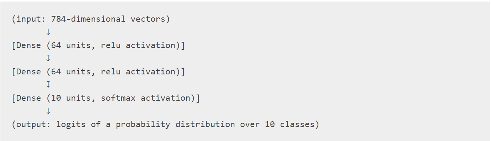

# KERAS
## FONKSİYONEL API
Keras Functional api sequential apiye göre daha flexible olmamıza olanak sağlar. Functional api non-linear topolojide modeller oluşturmamıza, aynı layerin paylaşılmasına ve çoklu input ve outputlar oluşturmamıza olanak sağlar.  
  

Functional API ile model oluşturmak için öncelikle input node oluşturmamız gerekiyor. 


```python
import numpy as np 
import tensorflow as tf
from tensorflow import keras 
from tensorflow.keras import layers
```


```python
inputs = keras.Input(shape=(784,)) # datanın shapei 784 uzunluğunda bir vektör
# Eğer 32,32,3 şeklinde bir image kullanıcak olursak aşağıdak gibi oluşturmamız gerekir
# inputs = keras.Input(shape=(32,32,3))

print(inputs.shape) # inputun shapeini döndürmek için 
print(inputs.dtype) # inputun veri tipini döndürmek için 
```

    (None, 784)
    <dtype: 'float32'>
    


```python
# Graph üzerinde yeni bir node oluşturmak için ; 
# "layer_call" işlemi input katmanından oluşturduğumuz katmana ok çizmek gibi düşünülebilir. İnputları dense layera göndeririz. ve çıktı olarak x alırız.
dense = layers.Dense(64,activation="relu")
x = dense(inputs)
# Bir kaç katman daha ekleyelim ;
x = layers.Dense(64,activation = "relu")(x)
outputs = layers.Dense(10)(x)
```


```python
# Bu noktanda sonra input ve outputları belirtip modeli oluşturabiliriz.
model = keras.Model(inputs = inputs,outputs=outputs,name="mnist_model")
# Modelin yapısını görmek için summary() metodunu kullanabiliriz. 
model.summary()
```

    Model: "mnist_model"
    _________________________________________________________________
    Layer (type)                 Output Shape              Param #   
    =================================================================
    input_1 (InputLayer)         [(None, 784)]             0         
    _________________________________________________________________
    dense (Dense)                (None, 64)                50240     
    _________________________________________________________________
    dense_1 (Dense)              (None, 64)                4160      
    _________________________________________________________________
    dense_2 (Dense)              (None, 10)                650       
    =================================================================
    Total params: 55,050
    Trainable params: 55,050
    Non-trainable params: 0
    _________________________________________________________________
    


```python
# Ayrıca modelin graph şeklinde plot edebiliriz. 
keras.utils.plot_model(model,"model_plot/my_first_model.png")
keras.utils.plot_model(model, "model_plot/my_first_model_with_shape_info.png", show_shapes=True) # input ve output shapeleride plot etmek için 

```


    

    


## Training, evaluation and Inference 
Funtional ve sequential apide eğitim, değerlendirme ve inference aynı şekilde çalışır.  
Model sınıfında built-in olarak fit ve evaluate metodları bulunur. Bunlar modelin eğtilmesi ve değerlendirmesinde kullanılır. 


```python
# Mnist datasının indirilmesi, train ve test olarak ayrılması ; 
(x_train, y_train), (x_test, y_test) = keras.datasets.mnist.load_data()

# 28,28,1 şeklinde olan imageler 784 uzunluğunda vektörlere çevirim 0-1 arasında normalize ediyoruz. 
x_train = x_train.reshape(60000,784).astype("float32") / 255
x_test = x_test.reshape(10000,784).astype("float32") / 255

# Modelin compile edilmesi; Burada kullanılack loss fonksiyonu, optimizer ve değerlendirme metrikleri belirlenir. 
# from_logits=True -- > Model tarafından çıkarılan output değerinin normalize edilmediğini, softmax kullanılmadığını bilgilendirmek için kullanırız
model.compile(loss = keras.losses.SparseCategoricalCrossentropy(from_logits=True),optimizer=keras.optimizers.RMSprop(),metrics=["accuracy"])

# model.fit ile eğitimi başlatıyoruz. Burada input olarak eğitim verilerini ve bunların labellarını gönderiyoruz. 
# modelin kaç epoch eğitileceği, eğitim datasından bir kısımda validation için ayırıyoruz. 
# aynı zamanda eğitimi history değişkeninde tutarak daha sonra değerlendirme metiklerinin epochlar içerisinde değişimlerini inceleyebiliriz. 
history = model.fit(x_train,y_train,batch_size=64,epochs=2,validation_split=0.2)

# Modelin başarısının ölçülmesi için evaluate metodunu kullanıyoruz. Burada test verilerini gönderiyoruz
test_scores = model.evaluate(x_test,y_test,verbose=2)

print("Test Loss:",test_scores[0])
print("Test Acc:",test_scores[1])
```

    Epoch 1/2
    750/750 [==============================] - 5s 5ms/step - loss: 0.3438 - accuracy: 0.9035 - val_loss: 0.1837 - val_accuracy: 0.9491
    Epoch 2/2
    750/750 [==============================] - 3s 4ms/step - loss: 0.1659 - accuracy: 0.9514 - val_loss: 0.1375 - val_accuracy: 0.9582
    313/313 - 0s - loss: 0.1339 - accuracy: 0.9600
    Test Loss: 0.13385729491710663
    Test Acc: 0.9599999785423279
    

# Save and Serialize
Modelin save edilmesi ve serailize edilmesi aynı şekilde yapılır. model.save() metoduyla tüm modeli tek bir dosyaya kaydedebiliriz. Daha sonra bu dosyayı kullanarak modeli tekrar oluşturabiliriz.  
Bu kaydedilen dosya içerisinde model mimarisi, modelin ağırlık değerleri(eğitim sırasında öğrenilen),config bilgileri bilgileri bulunur. Eğer eğitim tamamlanmadıysa bu dosya ile kaldığı yerden devam ettirebiliriz.  


```python
model.save("models/mnist_model")
del model  # modeli siliyoruz
# Kaydettiğimiz dosyadan tekrar modeli oluşturuyoruz. 
model = keras.models.load_model("models/mnist_model")
```

    INFO:tensorflow:Assets written to: models/mnist_model\assets
    

## Aynı layerları kullanarak birden fazla model oluşturma 
Funcional API de modeller input ve output değerlerinin layerlarda oluşturulması ile oluşturulur. Buda layerların birden çok model oluşturmasına olanak sağlar.  
Aşağıdaki örnekte aynı layer dizisinin 2 model oluşturduğunu görebilirsiniz.  
Encoder modeli -- > inputu alıp 16 boyutlu bir vektöre çevirir.  
Autoencoder modeli --> İnputu olarak encoder modelinin inputu alıp kendi bir autput üretir. (encoder modeli + decoder modeli = autoencoder modeli)  
Aşağıda verilen decoder modeli encoder modelinin simetrik olarak yeniden yazılması ile oluşturulur.


```python
encoder_input = keras.Input(shape=(28, 28, 1), name="img")
x = layers.Conv2D(16, 3, activation="relu")(encoder_input)
x = layers.Conv2D(32, 3, activation="relu")(x)
x = layers.MaxPooling2D(3)(x)
x = layers.Conv2D(32, 3, activation="relu")(x)
x = layers.Conv2D(16, 3, activation="relu")(x)
encoder_output = layers.GlobalMaxPooling2D()(x)

# encoder_input ve encoder_output ile model oluşturuluyor.
encoder = keras.Model(encoder_input,encoder_output,name="encoder") 
print(encoder.summary())

x = layers.Reshape((4,4,1))(encoder_output)
x = layers.Conv2DTranspose(16,3,activation="relu")(x)
x = layers.Conv2DTranspose(32,3,activation="relu")(x)
x = layers.UpSampling2D(3)(x)
x = layers.Conv2DTranspose(16,3,activation="relu")(x)
decoder_output = layers.Conv2DTranspose(1,3,activation="relu")(x)

# encoder modeline decoder modeli eklenerek autoencoder modeli oluşturuyor. 
autoencoder = keras.Model(encoder_input,decoder_output,name="autoencoder")
print(autoencoder.summary())
```

    Model: "encoder"
    _________________________________________________________________
    Layer (type)                 Output Shape              Param #   
    =================================================================
    img (InputLayer)             [(None, 28, 28, 1)]       0         
    _________________________________________________________________
    conv2d (Conv2D)              (None, 26, 26, 16)        160       
    _________________________________________________________________
    conv2d_1 (Conv2D)            (None, 24, 24, 32)        4640      
    _________________________________________________________________
    max_pooling2d (MaxPooling2D) (None, 8, 8, 32)          0         
    _________________________________________________________________
    conv2d_2 (Conv2D)            (None, 6, 6, 32)          9248      
    _________________________________________________________________
    conv2d_3 (Conv2D)            (None, 4, 4, 16)          4624      
    _________________________________________________________________
    global_max_pooling2d (Global (None, 16)                0         
    =================================================================
    Total params: 18,672
    Trainable params: 18,672
    Non-trainable params: 0
    _________________________________________________________________
    None
    Model: "autoencoder"
    _________________________________________________________________
    Layer (type)                 Output Shape              Param #   
    =================================================================
    img (InputLayer)             [(None, 28, 28, 1)]       0         
    _________________________________________________________________
    conv2d (Conv2D)              (None, 26, 26, 16)        160       
    _________________________________________________________________
    conv2d_1 (Conv2D)            (None, 24, 24, 32)        4640      
    _________________________________________________________________
    max_pooling2d (MaxPooling2D) (None, 8, 8, 32)          0         
    _________________________________________________________________
    conv2d_2 (Conv2D)            (None, 6, 6, 32)          9248      
    _________________________________________________________________
    conv2d_3 (Conv2D)            (None, 4, 4, 16)          4624      
    _________________________________________________________________
    global_max_pooling2d (Global (None, 16)                0         
    _________________________________________________________________
    reshape (Reshape)            (None, 4, 4, 1)           0         
    _________________________________________________________________
    conv2d_transpose (Conv2DTran (None, 6, 6, 16)          160       
    _________________________________________________________________
    conv2d_transpose_1 (Conv2DTr (None, 8, 8, 32)          4640      
    _________________________________________________________________
    up_sampling2d (UpSampling2D) (None, 24, 24, 32)        0         
    _________________________________________________________________
    conv2d_transpose_2 (Conv2DTr (None, 26, 26, 16)        4624      
    _________________________________________________________________
    conv2d_transpose_3 (Conv2DTr (None, 28, 28, 1)         145       
    =================================================================
    Total params: 28,241
    Trainable params: 28,241
    Non-trainable params: 0
    _________________________________________________________________
    None
    

# Tüm modeller layerlar gibi çağrılabilir
Herhangi bir modeli girişte yada başka bir modelin çıkışında kullanarak bir layer gibi davranabiliriz. Bir modeli çağırarak sade model mimarisini değil weightlerinide kullanıyoruz.  
Aşağıda autoencoder oluştururken encoder ve decoder modellerini ayrı ayrı oluşturup bunları ayrıca çağırıyoruz. 


```python
encoder_input = keras.Input(shape=(28, 28, 1), name="original_img")
x = layers.Conv2D(16, 3, activation="relu")(encoder_input)
x = layers.Conv2D(32, 3, activation="relu")(x)
x = layers.MaxPooling2D(3)(x)
x = layers.Conv2D(32, 3, activation="relu")(x)
x = layers.Conv2D(16, 3, activation="relu")(x)
encoder_output = layers.GlobalMaxPooling2D()(x)

encoder = keras.Model(encoder_input, encoder_output, name="encoder")
# print(encoder.summary())

decoder_input = keras.Input(shape=(16,), name="encoded_img")
x = layers.Reshape((4, 4, 1))(decoder_input)
x = layers.Conv2DTranspose(16, 3, activation="relu")(x)
x = layers.Conv2DTranspose(32, 3, activation="relu")(x)
x = layers.UpSampling2D(3)(x)
x = layers.Conv2DTranspose(16, 3, activation="relu")(x)
decoder_output = layers.Conv2DTranspose(1, 3, activation="relu")(x)

decoder = keras.Model(decoder_input,decoder_output,name="decoder")

# print(decoder.summary())

autoencoder_input = keras.Input(shape=(28,28,1),name="img")
encoded_img = encoder(autoencoder_input)
decoded_img = decoder(encoded_img)
autoencoder = keras.Model(autoencoder_input,decoded_img,name="autoencoder")
print(autoencoder.summary())
```

    Model: "autoencoder"
    _________________________________________________________________
    Layer (type)                 Output Shape              Param #   
    =================================================================
    img (InputLayer)             [(None, 28, 28, 1)]       0         
    _________________________________________________________________
    encoder (Functional)         (None, 16)                18672     
    _________________________________________________________________
    decoder (Functional)         (None, 28, 28, 1)         9569      
    =================================================================
    Total params: 28,241
    Trainable params: 28,241
    Non-trainable params: 0
    _________________________________________________________________
    None
    

Görüldüğü gibi modeller iç içe kullanılabilir. Modellerin içerisinde sub-modeller olabilir. (Layerlar gibi). İç içe modellerde en bilinen yöntem ensemblingdir.  
Aşağıda 3 modelin predictionlarının ortalamasını alan bir ensemble model oluşturalım. 


```python
def get_model():
    inputs = keras.Input(shape=(128,))
    outputs = layers.Dense(1)(inputs)
    return keras.Model(inputs, outputs)

# get model fonksiyon ile 3 model oluşturuluyor 
model1 = get_model() 
model2 = get_model()
model3 = get_model()

# 3 modelin çıktılarını ortalamaları alınıp oluşturulan büyük modelin output değeri bulunuyor. 
inputs = keras.Input(shape=(128,))
y1 = model1(inputs)
y2 = model2(inputs)
y3 = model3(inputs)
outputs = layers.average([y1, y2, y3])
ensemble_model = keras.Model(inputs=inputs, outputs=outputs)
```

## Karmaşık Graph Topolojileri
### Birden fazla çıktısı ve girdisi olan modeller
Functional API ile birden fazla input ve output ile modeller oluşturmak oldukça kolay ancak bunu Sequential API ile oluşturamıyoruz.  
Örneğin müşterilerin açtığı sorun ticketlarının önem derecesi ile birlikte doğru departmanlara yönlendirilmesi için bir model oluşturmak istiyorsak. 3 inputumuz olacak ; 
* ticketın başlığı (text)
* ticketin metni  (text)
* kullanıcı tarafından eklenen taglar (categorical)

Bu modelin 2 çıktısı olacak ; 
* önem derecesi
* ticketın ileticeği departman

Functional API ile bir kaç satırda bu işlemleri yapabiliriz.


```python
num_tags = 12 # tag sayısı 
num_words = 10000 # sözlükteki kelime sayısı
num_departments = 4 # tahmin için gerekli olan departman sayısı

title_input = keras.Input(shape=(None,),name="title") # int sequence
body_input = keras.Input(shape=(None,),name="body") # int sequence
tags_input = keras.Input((num_tags,),name="tags") # binary vektör 

# Title içerisindeki her kelimeyi 64 boyutlu bir vektöre gömelim 
title_features = layers.Embedding(num_words,64)(title_input)
# body içerisindeki her kelimeyi 64 boyutlu bir vektöre gömelim 
body_features = layers.Embedding(num_words,64)(body_input)

# embedded kelimeleri 128 boyutlu bir vektöre düşürelim. Normalde 64*10000 = boyutlu bir matriksti
title_features = layers.LSTM(128)(title_features)
# embedded kelimeleri 32 boyutlu bir vektöre düşürelim.
body_features = layers.LSTM(32)(body_features)

# Uygun olan tüm featureları concatenation ile tek büyük bir vektöre çevirelim 
x = layers.concatenate([title_features,body_features,tags_input])

# Logistic regression ile öenm derecesini belirleyelim
priority_pred = layers.Dense(1,name="priority")(x)
# Departman tahmini için 
department_pred = layers.Dense(num_departments,name="department")(x)

# End-to-End modeli oluşturalım 
model = keras.Model(inputs=[title_input,body_input,tags_input],outputs=[priority_pred,department_pred])

```


```python
keras.utils.plot_model(model,"model_plot/multi_input_and_output_model.png",show_shapes=True)
```


    

    


```python
# Modeli compile ederken her bir output için farklı losslar verebiliriz. Her bir lossa son kararda ne kadar etkili olacakları
# için bir ağırlık dahi verebiliriz. Total lossa ne kadar eklendikleri için 

model.compile(
    optimizer=keras.optimizers.RMSprop(1e-3),
    loss={
        "priority": keras.losses.BinaryCrossentropy(from_logits=True),
        "department": keras.losses.CategoricalCrossentropy(from_logits=True),
    },
    loss_weights={"priority": 1.0, "department": 0.2},
)
```


```python
# Dummy input data
title_data = np.random.randint(num_words,size=(1280,10))
body_data = np.random.randint(num_words,size=(1280,100))
tags_data = np.random.randint(2,size=(1280,num_tags)).astype("float32")

# Dummy target data 
priority_targets = np.random.random(size=(1280,1))
dept_targets = np.random.randint(2, size=(1280, num_departments))

model.fit(
    {"title": title_data, "body": body_data, "tags": tags_data},
    {"priority": priority_targets, "department": dept_targets},
    epochs=2,
    batch_size=32,
)
```

    Epoch 1/2
    40/40 [==============================] - 4s 12ms/step - loss: 1.2761 - priority_loss: 0.7035 - department_loss: 2.8632
    Epoch 2/2
    40/40 [==============================] - 0s 13ms/step - loss: 1.2748 - priority_loss: 0.7004 - department_loss: 2.8718
    


    <keras.callbacks.History at 0x13820bd9940>


## Basit bir ResNet Model Örneği 
Birden fazla input ve outputlu modellere ek olarak Functional apide topolojilerde liner olmayan bağlantılarda kolayca sağlanabilir. Sequential API ile bunu gerçekleştiremeyiz.  
Basit bir resnet modeli oluşturalım ve residual connectionların nasıl yapıldığını görelim. CIFAR10 verisetinde inceleyelim.


```python
inputs = keras.Input(shape=(32, 32, 3), name="img")
x = layers.Conv2D(32, 3, activation="relu")(inputs)
x = layers.Conv2D(64, 3, activation="relu")(x)
block_1_output = layers.MaxPooling2D(3)(x)

x = layers.Conv2D(64, 3, activation="relu", padding="same")(block_1_output)
x = layers.Conv2D(64, 3, activation="relu", padding="same")(x)
block_2_output = layers.add([x, block_1_output]) # 1.bloğun outputu 2. bloğun outputuna ekleniyor

x = layers.Conv2D(64, 3, activation="relu", padding="same")(block_2_output)
x = layers.Conv2D(64, 3, activation="relu", padding="same")(x)
block_3_output = layers.add([x, block_2_output]) #2.bloğun outputu 3.bloğun outputuna ekleniyor.

x = layers.Conv2D(64, 3, activation="relu")(block_3_output)
x = layers.GlobalAveragePooling2D()(x)
x = layers.Dense(256, activation="relu")(x)
x = layers.Dropout(0.5)(x)
outputs = layers.Dense(10)(x)

model = keras.Model(inputs, outputs, name="toy_resnet")
model.summary()
```

    Model: "toy_resnet"
    __________________________________________________________________________________________________
    Layer (type)                    Output Shape         Param #     Connected to                     
    ==================================================================================================
    img (InputLayer)                [(None, 32, 32, 3)]  0                                            
    __________________________________________________________________________________________________
    conv2d_8 (Conv2D)               (None, 30, 30, 32)   896         img[0][0]                        
    __________________________________________________________________________________________________
    conv2d_9 (Conv2D)               (None, 28, 28, 64)   18496       conv2d_8[0][0]                   
    __________________________________________________________________________________________________
    max_pooling2d_2 (MaxPooling2D)  (None, 9, 9, 64)     0           conv2d_9[0][0]                   
    __________________________________________________________________________________________________
    conv2d_10 (Conv2D)              (None, 9, 9, 64)     36928       max_pooling2d_2[0][0]            
    __________________________________________________________________________________________________
    conv2d_11 (Conv2D)              (None, 9, 9, 64)     36928       conv2d_10[0][0]                  
    __________________________________________________________________________________________________
    add (Add)                       (None, 9, 9, 64)     0           conv2d_11[0][0]                  
                                                                     max_pooling2d_2[0][0]            
    __________________________________________________________________________________________________
    conv2d_12 (Conv2D)              (None, 9, 9, 64)     36928       add[0][0]                        
    __________________________________________________________________________________________________
    conv2d_13 (Conv2D)              (None, 9, 9, 64)     36928       conv2d_12[0][0]                  
    __________________________________________________________________________________________________
    add_1 (Add)                     (None, 9, 9, 64)     0           conv2d_13[0][0]                  
                                                                     add[0][0]                        
    __________________________________________________________________________________________________
    conv2d_14 (Conv2D)              (None, 7, 7, 64)     36928       add_1[0][0]                      
    __________________________________________________________________________________________________
    global_average_pooling2d (Globa (None, 64)           0           conv2d_14[0][0]                  
    __________________________________________________________________________________________________
    dense_6 (Dense)                 (None, 256)          16640       global_average_pooling2d[0][0]   
    __________________________________________________________________________________________________
    dropout (Dropout)               (None, 256)          0           dense_6[0][0]                    
    __________________________________________________________________________________________________
    dense_7 (Dense)                 (None, 10)           2570        dropout[0][0]                    
    ==================================================================================================
    Total params: 223,242
    Trainable params: 223,242
    Non-trainable params: 0
    __________________________________________________________________________________________________
    


```python
keras.utils.plot_model(model, "model_plot/mini_resnet.png", show_shapes=True)
```


    

    


```python
(x_train, y_train), (x_test, y_test) = keras.datasets.cifar10.load_data()

x_train = x_train.astype("float32") / 255
x_test = x_test.astype("float32") / 255
y_train = keras.utils.to_categorical(y_train,10)
y_test = keras.utils.to_categorical(y_test,10)

model.compile(optimizer=keras.optimizers.RMSprop(1e-3),loss=keras.losses.CategoricalCrossentropy(from_logits=True),
             metrics=["acc"])
# datasını ufak bir kısmı ile eğitim yapıyoruz. Hızlı sonuç görmek içim 
model.fit(x_train[:1000], y_train[:1000], batch_size=64, epochs=1, validation_split=0.2)

```

    13/13 [==============================] - 4s 54ms/step - loss: 2.3055 - acc: 0.1138 - val_loss: 2.2882 - val_acc: 0.0900
    


    <keras.callbacks.History at 0x1380ec91ef0>


## Sharred Layers
Functional API nin güzel özelliklerinden biride sharred layerslardır. Sharred layerlar, aynı model içerisinde birden fazla kez kullanılan layerlardır. Birden fazla yol ile öğrenirler.  
Sharred layerlar genellikle aynı örnek uzayındaki inputlar için kullanılır. Ortak kelimeler içeren farklı textlerde kullanılabilir. Farklı inputlardan aldıkları bilgileri paylaşırlar. Modelin daha az daha ile daha iyi çalışmasına olanak sağlarlar.  
Aşağıdaki örnekte Embbeding katmanı 2 farklı text inputu tarafından paylaşılmıştır. 


```python
# 1000 unique kelime 128 boyutlu vektörler ile gösteriliyor 
sharred_embedding = layers.Embedding(1000,128)

text_input_a = keras.Input(shape=(None,),dtype="int32")

text_input_b = keras.Input(shape=(None,),dtype="int32")

encoded_input_a = sharred_embedding(text_input_a)
encodded_input_b = sharred_embedding(text_input_b)
```

## Layerları extract etmek ve tekrar kullanma 
Model içerisindeki orta katmanlardaki layerlara ulaşıp bunları tekrar kullanabiliriz. Özellikle feature extractionda sıklıkla kullanabiliriz.  


```python
# Örneğin ImageNet datası ile eğitilmiş VGG19 modeline bakalım.  
vgg19 = tf.keras.applications.VGG19()
# her bir layerın çıktısını alalım
feature_list = [layer.output for layer in vgg19.layers]

# vgg19 modelinin özellik çıkarma özelliğini kullanarak yeni bir model oluşturup bu modeli özellik çıkarmada kullanabilirz.
feat_extraction_model = keras.Model(inputs=vgg19.input,outputs=feature_list)

# Bu yapı genellikle neuro style transferde kullanılıyor.
img = np.random.random((1, 224, 224, 3)).astype("float32")
extracted_features = feat_extraction_model(img)
```

## Custom Layerlar
* tf.keras içerisinde birçok built-in layer var. Örneğin ; 
    * Convolutional Layers
    * Pooling Layers
    * RNN Layers
    * Batch Normalization, Embedding vb.  

* Bu layerlar isteklerimizi karşılayamıyorsa, apiyi extend ederek kendi layerlarımızı oluşturabiliriz. Layer sınıfınından alt sınıf oluşturarak gerekli metodları implement etmemiz gerekiyor ; 
    * call methodu: layerda yapılan hesaplamalar için
    * build methodu: layerde bulunan weightleri oluşturmak için ("__init__" içerisinde de oluşturabiliriz.)   
    
Aşağıda dense layerın basit bir implemetasyonunu görebilirsiniz.  


```python
class CustomDense(layers.Layer):
    def __init__(self,units=32):
        super(CustomDense,self).__init__()
        self.units = units
    def build(self,input_shape):
        self.w = self.add_weight(shape=(input_shape[-1],self.units),
                                initializer="random_normal",
                                trainable=True)
        self.b = self.add_weight(shape=(self.units,),initializer="random_normal",trainable=True)
        
    def call(self,inputs):
        return tf.matmul(inputs,self.w)+self.b
    
    # serialization yapabilmek için
    def get_config(self):
        return {"units":self.units}


inputs = keras.Input((4,))
outputs = CustomDense(10)(inputs)
model = keras.Model(inputs,outputs)
config = model.get_config()

new_model = keras.Model.from_config(config, custom_objects={"CustomDense": CustomDense})

```

## Functional API ne zaman kullanılmalı 
Keras functional API kullanarak mı yoksa Model sınfından subclass oluşturarak mı model oluşturmamız gerektiği sorusuna cevap vericek olursak. Genellikle functional api high-level, kullanımı kolay ve güvenlidir ve aynı zamanda subclass modellerin yapamacağı bir çok özelliğide vardır.  
Ancak, model subclassing ile daha flexible bir şekilde modeller oluşturabiliriz. Functinonal API nin desteklemediği bir çok özelliği oluşturabiliriz.  

### Functional API güçlü yanları: 
Burada belirttiğimiz özellikler sequential model için de geçerlidir ancak subclasslarda geçerli değildir.  
#### Daha az ayrıntı 
super(MyClass, self).__init__(...) ve call build gibi metodlara ihtiyacımız yoktur.  


```python
# FUNCTIONAL API İLE 
inputs = keras.Input(shape=(32,))
x = layers.Dense(64, activation='relu')(inputs)
outputs = layers.Dense(10)(x)
mlp = keras.Model(inputs, outputs)

# SUBCLASS İLE 
class MLP(keras.Model):

    def __init__(self, **kwargs):
        super(MLP, self).__init__(**kwargs)
        self.dense_1 = layers.Dense(64, activation='relu')
        self.dense_2 = layers.Dense(10)

    def call(self, inputs):
        x = self.dense_1(inputs)
        return self.dense_2(x)

mlp = MLP()
_ = mlp(tf.zeros((1, 32)))
```

#### Model debugging kolaydır
Functional API de Input ile input belirtmek (shape ve veri tipiyle) büyük bir avantajdır. Her bir katmanı çağırdığımızda belirtilen beklenen datayla gönderilen data uyumlumu kontrolü yapılır ve hata logu ekrana basılır.  
Modeli oluşturulken tüm debugging işlemlerinin yapılacağı garanti edilir.  

#### Plot edilebilir ve gözlemlenebilir
Modeli rahatça plot ettirebilir ve oluşturduğumuz bağlantıların doğruluğunu gözlemleyebiliriz. 

#### Functional model kolayca serialize edilebilir veya kopyalabilirdir. 
Kolayca serialize edip tek bir dosya ile tekrar oluştrabiliriz. Orjinal koda ihtiyaç olmadan aynı modeli tekrar tekrar oluşturabilmemize olanak sağlar.  
Subclass yönetinde ise get_config() metodu oluşturmamız gerekir. Kullanmak içinde from_config() ile tekrar oluştmamız gerekir. 

## Functional API nin zayıf yönleri
Dinamik yapıları desteklemez modellere DAGs of layer olarak davranır. (Sadece ileri yönlü - döngüsel olmayan olarak düşünebiliriz.)  
Bir çok deep learning modelinde bu mantıklı olabilir ancak recursive networkleri bu şekilde oluşturmamız pek mümkün değil. 

## Birlikte Kullanabilme 
Keresta functional API, subclassing, sequential API hangisini tercih ettiğimiz kesin bir karar olmak zorunda değil. Model içerisidne tüm bunları birlikte kullanabiliriz.  
Aşağıda functional API ve subclass modelin birlikte kullanıma örnek verebiliriz. 


```python
units = 32
timesteps = 10
input_dim = 5

# Functional Model
inputs = keras.Input((None, units))
x = layers.GlobalAveragePooling1D()(inputs)
outputs = layers.Dense(1)(x)
model = keras.Model(inputs, outputs)

class CustomRNN(layers.Layer):
    def __init__(self):
        super(CustomRNN, self).__init__()
        self.units = units
        self.projection_1 = layers.Dense(units=units, activation="tanh")
        self.projection_2 = layers.Dense(units=units, activation="tanh")
        self.classifier = model

    def call(self, inputs):
        outputs = []
        state = tf.zeros(shape=(inputs.shape[0], self.units))
        for t in range(inputs.shape[1]):
            x = inputs[:, t, :]
            h = self.projection_1(x)
            y = h + self.projection_2(state)
            state = y
            outputs.append(y)
        features = tf.stack(outputs, axis=1)
        print(features.shape)
        return self.classifier(features)


rnn_model = CustomRNN()
_ = rnn_model(tf.zeros((1, timesteps, input_dim)))
```

    (1, 10, 32)
    


```python

```


```python

```
